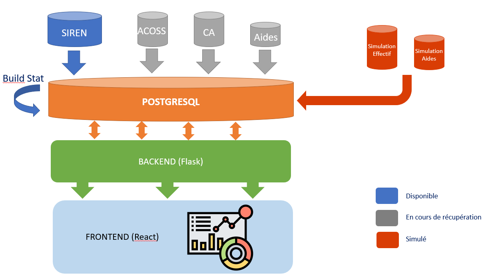

# Dashboard Aides aux Entreprises

----------------

### Scripts

Un certain nombre d'opérations sont nécessaires pour faire fonctionner l'application. Ces opérations sont décrites [ici](scripts/README.md)

### Backend (Flask)

Pour faire fonctionner le backend, rendez-vous [ici](backend/README.md)

### Frontend (Nuxt)

Pour faire fonctionner le frontend, rendez-vous [ici](frontend/README.md)

----------

### Architecture technique

Le schéma ci-dessous représente l'architecture cible à date de l'application :

